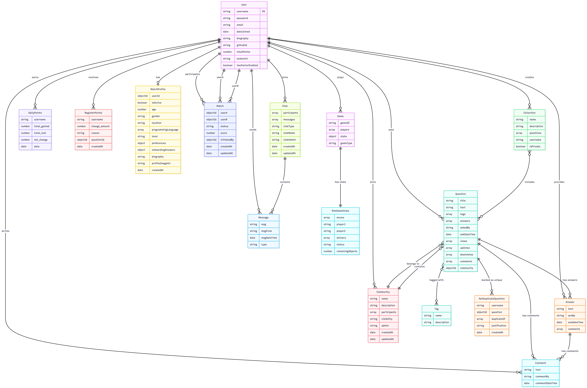

# Code2Date

## Getting Started

Run `npm install` in the root directory to install all dependencies for the `client`, `server`, and `shared` folders.

## Codebase Folder Structure

- `client`: Contains the frontend application code, responsible for the user interface and interacting with the backend. This directory includes all React components and related assets.
- `server`: Contains the backend application code, handling the logic, APIs, and database interactions. It serves requests from the client and processes data accordingly.
- `shared`: Contains all shared type definitions that are used by both the client and server. This helps maintain consistency and reduces duplication of code between the two folders. The type definitions are imported and shared within each folder's `types/types.ts` file.

## Database Architecture

The schemas for the database are documented in the directory `server/models/schema`.
A class diagram for the schema definition is shown below:



## API Routes

### `/answer`

| Endpoint   | Method | Description      |
| ---------- | ------ | ---------------- |
| `/addAnswer` | POST   | Add a new answer |

### `/comment`

| Endpoint    | Method | Description       |
| ----------- | ------ | ----------------- |
| `/addComment` | POST   | Add a new comment |

### `/messaging`

| Endpoint     | Method | Description           |
| ------------ | ------ | --------------------- |
| `/addMessage`  | POST   | Add a new message     |
| `/getMessages` | GET    | Retrieve all messages |

### `/question`

| Endpoint                       | Method | Description                     |
| -------------------------------| ------ | --------------------------------- |
| `/getQuestion`                 | GET    | Fetch questions by filter         |
| `/getQuestionById/`            | GET    | Fetch a specific question by ID   |
| `/addQuestion`                 | POST   | Add a new question                |
| `/upvoteQuestion`              | POST   | Upvote a question                 |
| `/downvoteQuestion`            | POST   | Downvote a question               |
| `/getQuestionsByTextAndTitle`  | GET    | Fetch questions by title and text |

### `/tag`

| Endpoint                       | Method | Description                                   |
| --------------------------     | ------ | --------------------------------------------- |
| `/getTagsWithQuestionNumber`   | GET    | Fetch tags along with the number of questions |
| `/getTagByName/`               | GET    | Fetch a specific tag by name                  |

### `/user`

| Endpoint                       | Method | Description                    |
| -------------------------------| ------ | ------------------------------ |
| `/signup`                      | POST   | Create a new user account      |
| `/login`                       | POST   | Log in as a user               |
| `/resetPassword`               | PATCH  | Reset user password            |
| `/getUser/`                    | GET    | Fetch user details by username |
| `/getUsers`                    | GET    | Fetch all users                |
| `/deleteUser/`                 | DELETE | Delete a user by username      |
| `/updateBiography`             | PATCH  | Update user biography          |
| `/deleteAvatar`                | DELETE | Delete an avatar from the user |
| `/uploadAvatar`                | PATCH  | Uploading avatar for the user  |
| `/2fa/generate/:username`      | POST   | Generates a new 2FA code       |
| `/2fa/enable`                  | POST   | Enables 2FA after verifying    |
| `/2fa/disable`                 | POST   | Disables 2FA for a user        |
| `/2fa/status/:username`        | GET    | Checks if 2FA is enabled       |

### `/chat`

| Endpoint                    | Method | Description     |
| --------------------------- | ------ | --------------------------------------------------------------------------- |
| `/createChat`               | POST   | Create a new chat.                                                          |
| `/:chatId/addMessage`       | POST   | Add a new message to an existing chat.                                      |
| `/:chatId`                  | GET    | Retrieve a chat by its ID, optionally populating participants and messages. |
| `/:chatId/addParticipant`   | POST   | Add a new participant to an existing chat.                                  |
| `/getChatsByUser/:username` | GET    | Retrieve all chats for a specific user based on their username.             |
| `/:chatId/leaveChat`        | POST   | Leave the group chat                                                        |
| `/createGroupChat`          | GET    | Creating the new group chat with participants                               |

### `/games`

| Endpoint     | Method | Description           |
| --------     | ------ | --------------------- |
| `/create`    | POST   | Create a new game     |
| `/join`      | POST   | Join an existing game |
| `/leave`     | POST   | Leave a game          |
| `/games`     | GET    | Retrieve all games    |

### `/api/collection`

| Endpoint                              | Method | Description                         |
| ------------------------------------- | ------ | ----------------------------------- |
| `/create`                             | POST   | Create a new collection             |
| `/delete/:collectionId`               | DELETE | Delete a collection                 |
| `/toggleSaveQuestion`                 | PATCH  | Add/remove question from collection |
| `/getCollectionsByUsername/:username` | GET    | Get collections by username         |
| `/getCollectionById/:collectionId`    | GET    | Get collection by ID                |

### `/api/community`

| Endpoint                       | Method | Description                        |
| ------------------------------ | ------ | ---------------------------------- |
| `/getCommunity/:communityId`   | GET    | Get a specific community           |
| `/getAllCommunities`           | GET    | Get all communities                |
| `/toggleMembership`            | POST   | Join/leave a community             |
| `/create`                      | POST   | Create a new community             |
| `/delete/:communityId`         | DELETE | Delete a community                 |

### `/api/notDuplicateQuestion`
| Endpoint                       | Method | Description                        |
| ------------------------------ | ------ | ---------------------------------- |
| `/saveNotDuplicateQuestion`    | POST   | Add a new not duplicate question   |

### `/api/matchProfile`

| Endpoint                             | Method | Description                        |
| -----------------------------------  | ------ | ---------------------------------- |
| `/getMatchProfile/:userId`           | GET    | Get a specific match profile       |
| `/getAllMatchProfiles/`              | GET    | Get all match profiles             |
| `/checkOnboardingStatus/:userId`     | GET    | Check a user's onboarding status   |
| `/toggleMatchProfileActive/:userId`  | PATCH  | Activate/deactivate a match profile|
| `/updateMatchProfile/:userId`        | PATCH  | Update a match profile             |
| `/create`                            | POST   | Create a match profile             |

### `/api/match`

| Endpoint                       | Method | Description                        |
| -----------------------------  | ------ | ---------------------------------- |
| `/getMatch/:matchId`           | GET    | Get a specific match               |
| `/getUserMatches/:userId`      | GET    | Get all users matches              |
| `/create`                      | POST   | Create a match                     |
| `/recommend/:userId`           | GET    | Recommend matches for users        |
| `/updateStatus/:matchId`       | PATCH  | Update the match's status          |
| `/delete/:matchId`             | DELETE | Delete a match                     |


## OpenAPI specification

- Start the server as specified earlier (`cd server && npm run dev`).
- Visit `http://localhost:8000/api/docs` to see the complete API specification in a user friendly manner.
- You should be able to see and test out individual endpoints using the *Try it out* button associated with each endpoint.

The specification itself is coupled with an OpenAPI validator (present as a middleware) that validates every request and response against the provided spec document.

### Setup Instructions

Server setup

1. Navigate to the `server` directory and install dependencies:
   ```sh
   cd server
   npm install
   ```
2. Create a `.env` file in the `server/` directory with the following content:
   ```
   MONGODB_URI=mongodb://127.0.0.1:27017   (refer to report doc for cluster specific secret)
   CLIENT_URL=http://localhost:4530
   PORT=8000
   GITHUB_CLIENT_ID=(refer to report doc to retrieve secret)
   GITHUB_CLIENT_SECRET=(refer to report doc to retreive secret)
   OAUTH_REDIRECT_URI=http://localhost:8000/api/auth/github/callback
   SENDGRID_API_KEY=(refer to report doc to retreive secret)
   JWT_SECRET=(refer to report doc to retreive secret)
   ```

   3. Start the server:
   ```sh
   npm run dev
   ```

Client setup

1. Navigate to the `client` directory and install dependencies:
   ```sh
   cd ../client
   npm install
   ```

2. Create a `.env` file in the `client/` directory with the following content:
   ```
   REACT_APP_SERVER_URL=http://localhost:8000
   ```

3. Start the client:
   ```sh
   npm run dev
   ```

Testing Setup

1. Navigate to the `testing` directory:
   ```sh
   cd testing
   ```

2. Install dependencies:
   ```sh
   npm install
   ```

3. Create a `.env` file in the `testing/` directory with the following content:
   ```
   MONGODB_URI=mongodb://127.0.0.1:27017
   ```

4. Make sure that both the server and client are already running

5. Run Cypress tests:
   ```sh
   npx cypress open
   ```

6. In the Cypress UI that opens:
   - Select *E2E Testing*
   - Choose your browser (Chrome is preferred)
   - Click on any of the test files to run it
   - If any of the tests fail, you should be able to see the exact sequence of steps that led to the failure.
